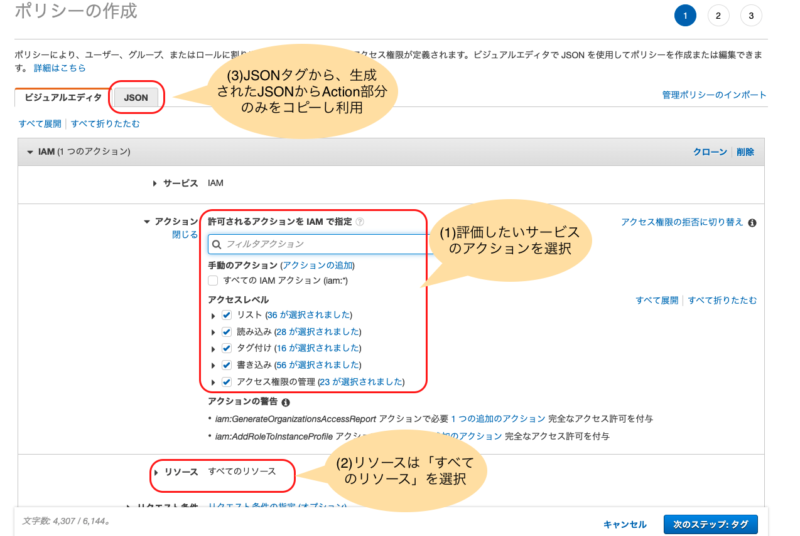

# iam-simulation
## 概要
</img>


本ツールは[IAM Policy simulator](https://policysim.aws.amazon.com/)を利用し対象とするIAMユーザ/グループ/ロールに対して指定したIAMアクションのが許可されるか否かを評価し、結果をJSONまたはCVS形式で出力するツールです。

コンソールでも[IAM Policy simulator](https://policysim.aws.amazon.com/)は利用可能ですが、評価対象のActionをGUIで選択する手間があること、評価結果をファイルに出力することができないこと、などがネックとなりますが本ツールを利用することでこれらの悩みを解消することができます。

## 使い方
### 実行環境の準備
前提として必要となるツールは以下の通りです。これらのツールを事前にインストールして下さい。
- python3
- [gitコマンド](https://git-scm.com/book/ja/v2/%E4%BD%BF%E3%81%84%E5%A7%8B%E3%82%81%E3%82%8B-Git%E3%81%AE%E3%82%A4%E3%83%B3%E3%82%B9%E3%83%88%E3%83%BC%E3%83%AB)
- [boto3](https://aws.amazon.com/jp/sdk-for-python/)
- [AWS CLI/boto3用のプロファイル](https://boto3.amazonaws.com/v1/documentation/api/latest/guide/configuration.html#using-a-configuration-file)

### ツール実行までの準備
#### ツールのセットアップ
任意のディレクトリで以下のコマンドを実行して下さい。
```shell
git clone https://github.com/Noppy/iam-simulation.git
cd iam-simulation
```
#### 評価対象のIAMユーザ/グループ/ロールの準備
 IAMポリシーの評価対象とするIAMユーザか、IAMグループ、またはIAMロールを準備し、そのARNを控えます。

#### 評価対象アクション一覧準備
評価対象のアクション一覧を書き形式のJSONファイルで準備します。
```JSON
{
    "Action": [
        "iam:CreateServiceSpecificCredential",
        "iam:DeactivateMFADevice",
        <中略>
        "iam:DeletePolicyVersion",
        "iam:ListUserTags"
    ]
}
```
アクション一覧の作成には、マネージメントコンソールのIAMポリシー作成時のビジュアルエディタを活用すると楽に作成できます。
</img>

またサンプルとして`actions`ディレクトリにIAM、EC2、S3のアクション一覧のJSONもありますので活用下さい(2022/3作成時点の一覧です)。
- IAMアクション一覧: `actions/iam_all_actions.json`
- EC2アクション一覧: `actions/ec2_all_actions.json`
- S3アクション一覧: `actions/s3_all_actions.json`

#　ツールの実行
```shell
./simulate_iampolicy.py [-h] [-P PROFILE] [-c] -p POLICY_SOURCE_ARN -a ACTION_LIST_FILE
```
- 必須オプション
    - `-p POLICY_SOURCE_ARN` : IAMユーザ/グループ/ロールのARNを指定
    - `-a ACTION_LIST_FILE` : 評価したいアクション一覧のJSONファイルパスを指定
- 任意オプション
    - `-P PROFILE` : AWS CLI/boto3のプロファイルを明示的に指定する
    - `-c`: 結果をCSV形式で出力したい場合に指定。未指定時はJSON形式で結果を出力する 
    - `-h`: ヘルプ


- (実行例1) IAMロールに対して、IAMのアクション一覧を評価しJSON形式で出力する
```shell
./simulate_iampolicy.py -p 'arn:aws:iam::999999999999:role/RoleName' -a 'actions/iam_all_actions.json'
```

- (実行例2) Hogeプロファイルのアカウントの特定IAMユーザ対し、S3のアクション一覧を評価しCSV形式で出力する。
```shell
./simulate_iampolicy.py -P Hoge -c -p 'arn:aws:iam::999999999999:user/UserName' -a 'actions/s3_all_actions.json'
```

#　実行結果
- JSON形式
```JSON
[
  {
    "EvalActionName": "iam:CreateServiceSpecificCredential",
    "EvalDecision": "allowed"
  },
  {
    "EvalActionName": "iam:DeactivateMFADevice",
    "EvalDecision": "explicitDeny"
  },
]
```
- CSV形式
```CSV
EvalActionName,EvalDecision
iam:CreateServiceSpecificCredential,allowed
iam:DeactivateMFADevice,explicitDeny
```

- 結果内容
    - `EvalActionName` : 評価対象のアクション名
    - `EvalDecision` : 評価結果
        - `allowed` : アクションを許可
        - `explicitDeny` : アクションを明示的に拒否
        - `implicitDeny` : アクションを暗黙的に拒否